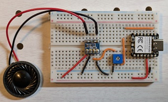

# 🎵 Electronic Music Box with Seeed Studio XIAO RA4M1

This repository contains the source code for an **electronic music box** built using the **Seeed Studio XIAO RA4M1**.

## 🚀 Performance Demo  
🎥 Watch the demo on YouTube:  

## 🛠 How to Build  
For step-by-step instructions, check out this article:  
📖 [How to Make an Electronic Music Box with XIAO RA4M1](https://zenn.dev/nyannkov/articles/xiao-ra4m1-make-an-electronic-music-box)
